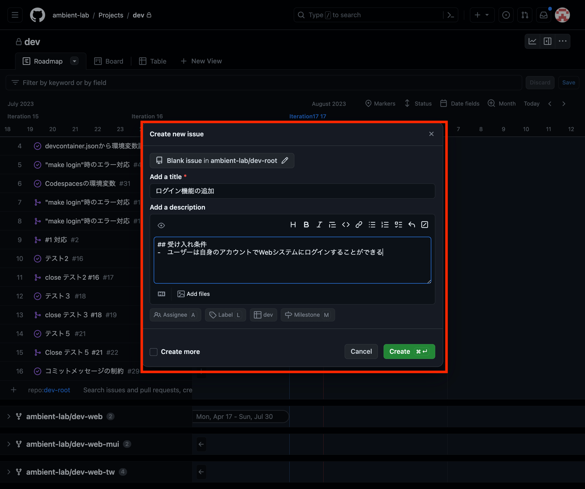
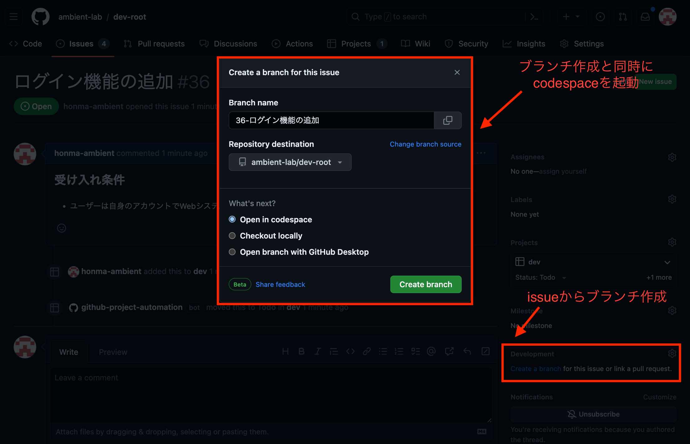
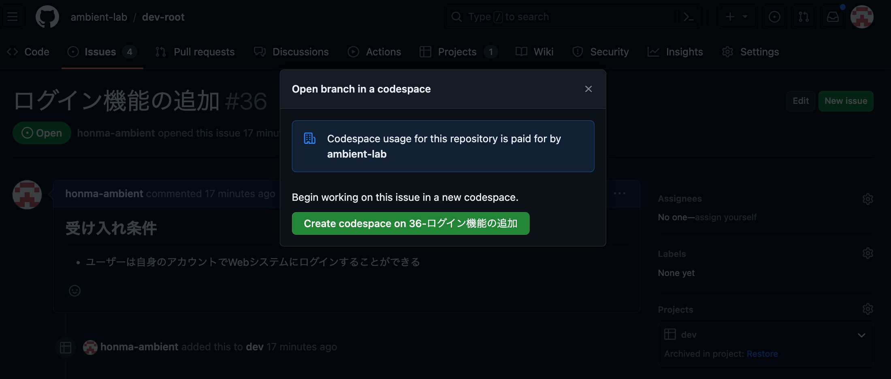
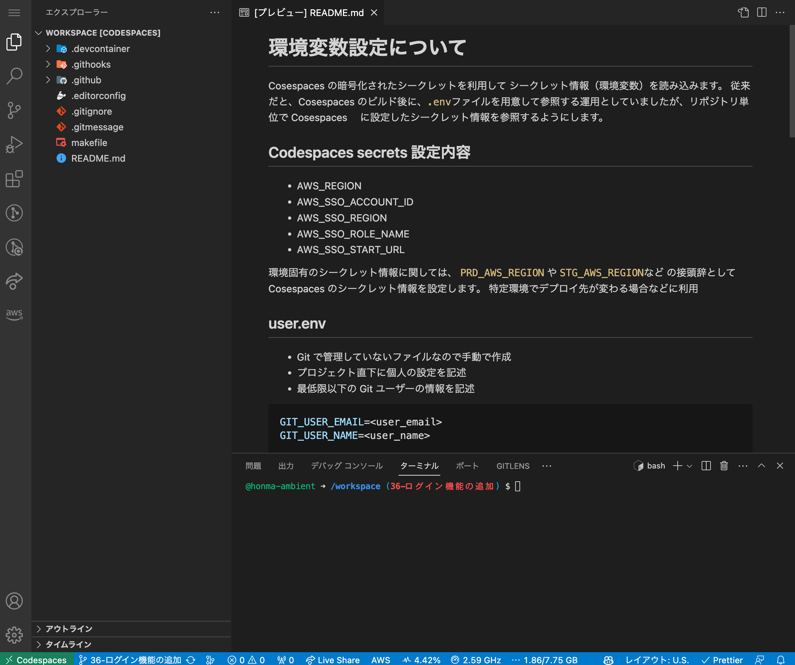
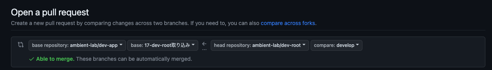

# 関連テンプレートリポジトリの README インデックス

関連しているテンプレートリポジトリの README に関する概要やリンクを記載しています。

- [ambient-tmpl-root](.devcontainer/features/root/README.md)
  - 最上位のテンプレートリポジトリ。

# テンプレートリポジトリについて

- GitHub で管理するリポジトリのテンプレートです。
- Docker コンテナの構築ソースも含んでおり、プロジェクトソースを VSCode で開くことでプロジェクト毎に Docker コンテナが構築できるようにしています。(DevContainer)

## テンプレートリポジトリの種類

### 各リポジトリの関係

```bash
ambient-tmpl-root
├── ambient-tmpl-web
│   ├── ambient-tmpl-web-tw
│   │   └── {プロジェクト名}-web
│   └── ambient-tmpl-web-mui
│       └── {プロジェクト名}-web
├── ambient-tmpl-app
│   　└── {プロジェクト名}-app
└── ambient-tmpl-infra
    └── {プロジェクト名}-infra
```

### [Root テンプレート](https://github.com/ambient-lab/ambient-tmpl-root)

基本 OS のテンプレート

### [Web テンプレート](https://github.com/ambient-lab/ambient-tmpl-web)

**ambient-tmpl-root** を fork して作られた Web システムの開発テンプレート

- React: フロントエンドフレームワーク
- Amplify: バックエンドフレームワーク

### [Web TW テンプレート](https://github.com/ambient-lab/ambient-tmpl-web-tw)

**ambient-tmpl-web** を fork して作られた Web システムのテンプレート

デザインを重視する場合は UI コンポーネントに [Tailwind CSS](https://tailwindcss.com/) を利用しているこちらのテンプレートを利用する

- Tailwind CSS: UI コンポーネント

### [Web MUI テンプレート](https://github.com/ambient-lab/ambient-tmpl-web-mui)

**ambient-tmpl-web** を fork して作られた Web システムのテンプレート

管理画面などデザインを重視しない場合は UI コンポーネントに [Material UI](https://mui.com/) を利用しているこちらのテンプレートを利用する

- Material UI(MUI): UI コンポーネント

### [App テンプレート](https://github.com/ambient-lab/ambient-tmpl-app)

**ambient-tmpl-root** を fork して作られた [Expo](https://expo.dev/) を利用するスマホアプリシステムのテンプレート

PoC 開発などデザインを重視しない場合は MUI を利用する

- ReactNative: フロントエンドフレームワーク
- Expo: ReactNative の拡張ツール
- Amplify: バックエンドフレームワーク
- MUI: UI コンポーネント （※要件的に MUI が許容できる場合)

### [Infra テンプレート](https://github.com/ambient-lab/ambient-tmpl-infra)

**ambient-tmpl-root** を fork して作られたインフラ構築のテンプレート
インフラや API、バッチなどの UI が伴わない開発に利用する

- [AWS CDK](https://docs.aws.amazon.com/ja_jp/cdk/v2/guide/getting_started.html): IaC(Infrastructure as Code)
- [AWS SAM](https://docs.aws.amazon.com/ja_jp/serverless-application-model/latest/developerguide/serverless-getting-started.html): サーバーレスアプリケーションを構築

# 利用するシェルについて

デフォルトシェルは`zsh`を利用します。

# 環境変数設定について

Codespaces の暗号化されたシークレットを利用して シークレット情報（環境変数）を読み込みます。

従来だと、 Codespaces のビルド後に、`.env`ファイルを用意して参照する運用としていましたが、リポジトリ単位で Codespaces に設定したシークレット情報を参照するようにします。

## Codespaces secrets 設定内容

- AWS_REGION: `ap-northeast-1`
- AWS_SSO_ACCOUNT_ID: `xxxxxxxxxx`
- AWS_SSO_REGION: `ap-northeast-1`
- AWS_SSO_ROLE_NAME: `AdministratorAccess`
- AWS_SSO_START_URL: `https://xxxxxxxxxx.awsapps.com/start`

### AWS MFA パターン

MFA での認証をする場合にも、Codespaces のシークレット情報（環境変数）を設定して読み込みます。

- AWS_MFA_ASSUME_ROLE: `arn:aws:iam::<account_id>:role/<role＿name>`
- AWS_MFA_ACCESS_KEY_ID: `<access_key_id>`
- AWS_MFA_SECRET_ACCESS_KEY: `<secret_access_key>`
- AWS_MFA_DEVICE=arn:aws:iam:: `<account_id>:mfa/<user_name>`

## user.env

- Git で管理していないファイルなので手動で作成
- プロジェクト直下に個人の設定を記述
- 最低限以下の Git ユーザーの情報を記述

```toml
GIT_USER_EMAIL=<user_email>
GIT_USER_NAME=<user_name>
```

### AWS Credentials パターン

## user.env

```toml
AWS_SECRET_ACCESS_KEY=<access_key_id>
AWS_SECRET_KEY=<secret_access_key>
```

# 環境構築

## 前提説明

GitHub が VSCode の環境をホストして提供してくれるクラウドサービスの [Codespaces](https://github.co.jp/features/codespaces) を利用して環境構築を行います。

Codespaces を利用するメリットとして下記があります。

- オンラインの開発環境であり、自分でローカルに環境を用意する必要がない
- ブラウザからアクセスでき、いつでもどこでも開発可能
- セットアップが簡単
- セキュリティが高く自分のデバイス上で開発するよりも安全

### Codespaces 起動手順

1. Project から Issue を作成

- リポジトリごとに Project を用意するため Project で機能開発やバグ修正などを管理します。
- Project にて、Issue を起票し、下記の通りどういったことをするのかタイトルや説明を追記します。
- ※ Issue が一つも存在しない場合は Project にリポジトリが表示されていないので、リポジトリの Issue ページから Issue を起票してください。
  
  - `.github/ISSUE_TEMPLATE配下に`に issue 起票のテンプレートを用意してます。
    ```
    .github
      ├── dependabot.yml
      └── ISSUE_TEMPLATE
          ├── bug_report.md
          ├── custom.md
          └── feature_request.md
    ```
- Issue を起票後、issue からブランチを作成します。下記の通り feature ブランチと codespace の起動も行います。
  
  

2. Codespace 起動
   Codespace が起動すると下記の通りのようにホストされます。
   
3. AWS の認証コマンド

下記コマンドで認証

```bash
$ make login
```

# GitHub リポジトリのチーム権限について

| チーム名     | 権限設定 | 権限説明                                              |
| ------------ | -------- | ----------------------------------------------------- |
| xxxx-private | Maintain | develop,main ブランチへのプルリクエストのマージが可能 |
| xxxx-public  | Write    | develop,main ブランチへのプルリクエストのマージが不可 |

# リポジトリのソースコード運用について

## リポジトリサイズの制限

https://docs.github.com/ja/repositories/working-with-files/managing-large-files/about-large-files-on-github#repository-size-limits

> リポジトリは小さく保ち、理想としては 1GB 未満、および 5GB 未満にすることを強くお勧めします。リポジトリが小さいほど、クローン作成が速く、操作やメンテナンスが簡単になります。

# Commit について

## 注意事項

**※`develop`や`main`ブランチへの直 Push は禁止します。(できないようにしています。)**  
必ず作業ブランチを切ってプルリクエストを作って、コードレビュー後にマージする運用とします。

## コミットメッセージのルール

開発者同士でコミット履歴を見やすくするためメッセージに規則性を持たせるよう、commit メッセージテンプレートを使って commit します。

詳しくは[github-tag-action のコミットメッセージの規則](#コミットメッセージの規則)に従ってください

## 優れた Git コミットメッセージの 7 つのルール

How to Write a Git Commit Message: https://cbea.ms/git-commit/

1. **件名と本文を空行で区切る**
2. **件名は 50 文字以内までにする**
3. **件名は大文字で始める**
4. **件名をピリオドや句読点で終わらせない**
5. **件名は命令形な雰囲気で使用する**
6. **本文を 72 文字ごとに改行する**
7. **本文を使用して、何を、なぜ、どのようにしたかを記述する**

## コミットメッセージの自動チェック

git Hooks を使ってコミット時にコミットメッセージの自動チェックをしています。  
下記のように、issue 番号を含めてないメッセージはコミットを取り消すように設定しています。

```bash
❯ git commit -m "テスト"
🪝 Running Git Hooks: commit-msg
 - issue番号の存在チェック: NG
================================================================
コミットメッセージにissue番号が含まれていません。

Example: #1234
================================================================

Git Hooks: commit-msg: NG

❯
```

# プルリクエストについて

- 作業ブランチから `develop`ブランチへプルリクエストを作成します。
- プルリクエストのマージについては最低 1 人以上のコードレビューがされないとマージできません。

## プルリクエストのマージ手法

GitHub にて用意されてるいずれかのプルリクエスト手法に基づいてコードレビュー者はマージできます。
開発者などで相談してマージ手法を決めて運用してください。

- マージコミット
  - 利点: 複数ブランチ・複数開発者のコミット変更履歴が残るため明確になる。
  - 欠点: 変更履歴が増えるので、リポジトリサイズが大きくなる
- スカッシュマージ
  - 利点: ブランチの変更履歴をコンパクトにしたい場合、有効なマージ手法
  - 欠点: 変更履歴が 1 つのコミットのため、変更の追跡やデバッグ時が困難
- リベースとマージ
  - 利点: マージ後の履歴をキレイに保てる、変更の適応順序や履歴の整理に適している手法
  - 欠点: リベース操作でブランチ履歴が書き換えられる。コンフリクトが起きると面倒。

# fork 元の取り込みについて

fork 元のリポジトリに更新があった場合に取り込みの作業が必要になります

## 取り込みの手順

### WebUI からフォークのブランチを取り込む

取り込むリポジトリの web ページから、「Sync fork」のボタンを押下して取り込みを行うことができます

手順の詳細は下記のリンクを確認してください。
[WebUI からの取り込み手順](https://docs.github.com/ja/pull-requests/collaborating-with-pull-requests/working-with-forks/syncing-a-fork?platform=mac#syncing-a-fork-branch-from-the-web-ui)

※コンフリクトがある場合はこちらの手順では取り込むことはできないので、下記に記載されているようにプルリクを作りそちらから取り込む必要があります

### プルリクからフォークのブランチを取り込む

- **はじめに「フォーク元の取り込み作業」のようなタイトルで issue を作成してください**
- **issue を作成後、作業ブランチを作成してください**
- **作業ブランチを作成後、Codespaces を起動してください**
  - [Codespaces 起動手順](#codespaces-起動手順)

#### コンフリクトの確認

1. 取り込み用ブランチに向けて、fork 元の develop をマージするためのプルリクを作成する画面でコンフリクトの確認をします。

   - 「compare across forks」を押すことでリポジトリから指定できるようになります。
     

2. fork 先の develop 　 ← 　 fork 元の develop へのプルリク差分表
   **差分があれば作業ブランチに取り込み必要です**

| 取り込みリポジトリ       | フォーク元リポジトリ | PR 差分                                                                                                                             |
| ------------------------ | -------------------- | ----------------------------------------------------------------------------------------------------------------------------------- |
| **ambient-tmpl-web**     | ambient-tmpl-root    | [PR リンク](https://github.com/ambient-lab/ambient-tmpl-web/compare/ambient-lab:develop...ambient-lab:ambient-tmpl-root:develop)    |
| **ambient-tmpl-web-tw**  | ambient-tmpl-web     | [PR リンク](https://github.com/ambient-lab/ambient-tmpl-web-tw/compare/ambient-lab:develop...ambient-lab:ambient-tmpl-web:develo)   |
| **ambient-tmpl-web-mui** | ambient-tmpl-web     | [PR リンク](https://github.com/ambient-lab/ambient-tmpl-web-mui/compare/ambient-lab:develop...ambient-lab:ambient-tmpl-web:develop) |
| **ambient-app**          | ambient-tmpl-root    | [PR リンク](https://github.com/ambient-lab/ambient-tmpl-app/compare/ambient-lab:develop...ambient-lab:ambient-tmpl-root:develop)    |
| **ambient-infra**        | ambient-tmpl-root    | [PR リンク](https://github.com/ambient-lab/ambient-tmpl-infra/compare/ambient-lab:develop...ambient-lab:ambient-tmpl-root:develop)  |

##### コンフリクトが無い場合

1. コンフリクトの確認を行った状態から、そのままプルリクエストを作成、マージします

2. 取り込み用ブランチから取り込みたいリポジトリの develop に向けてプルリクを作成し、マージします

##### コンフリクトがある場合

##### 対処法１

1. 取り込み用ブランチで codespaces を立ち上げ、下記コマンドを実行しコンフリクトを解消する
   1. git checkout -b ambient-lab-develop {取り込み用ブランチ}
   2. git pull --rebase https://github.com/ambient-lab/ambient-tmpl-{fork元のリポジトリ}.git develop
   3. git checkout {取り込み用ブランチ}
   4. git merge --no-ff ambient-lab-develop
      a. `fatal: refusing to merge unrelated histories`が発生した場合は`--allow-unrelated-histories`のオプションが必要になります。
   5. git push origin {取り込み用ブランチ}
2. 取り込み用ブランチから取り込みたいリポジトリの develop に向けてプルリクを作成し、マージしてもらう

##### 対処法 2

```
# リモートリポジトリの追加(されてなければ実行)
git remote add upstream https://github.com/ambient-lab/<フォーク元のリポジトリ名>.git

# リモートリポジトリの最新状態を取得
git fetch upstream

# リモートリポジトリの差分を表示
git diff upstream/develop

# 作業ブランチの作成(issueから作業ブランチ作成してる場合は実行不要)
git checkout -b <作業ブランチ>

# リモートリポジトリの変更をマージ
git merge upstream/develop

# コンフリクトが発生した場合は修正

# 変更をステージング（UI上からもで可能)
git add .

# コミット（UI上からもで可能)
git commit -m "feature update"

# 作業ブランチをリモートリポジトリにプッシュ（UI上からもで可能)
git push origin <作業ブランチ>
```

# バージョニングについて

互換性管理のため[セマンティックバージョニング](https://semver.org/lang/ja/)を採用しています  
バージョンは`メジャー.マイナー.パッチ`形式です  
プレリリース,ビルドナンバーなどのバージョン形式の拡張も可能ですが利用しません

## ルール

次のルールに従ってバージョンナンバーを管理してください

- `メジャー`
  - 互換性のない変更をした場合にインクリメントする
  - インクリメント時はマイナーとパッチを 0 にする
- `マイナー`
  - 後方互換性のある機能性を追加した場合にインクリメントする
  - インクリメント時はパッチを 0 にする
- `パッチ`
  - 後方互換性のあるバグ修正をした場合にインクリメントする

その他のルール

- メジャーバージョンの 0 は初期開発段階
  - 互換性のない変更がマイナー、パッチバージョンアップに含まれる可能性があります
- 各バージョンナンバーは正の整数で、先頭を 0 で埋めません
- いかなる修正であってもバージョンを上げます

## 指針

API やライブラリ・ツール等、他のシステムから利用してもらう場合や、フォークやテンプレートされるシステムではセマンティックバージョニングの[ルール](#ルール)を遵守してください

Web サイト等の人が使うシステムでは以下の方針に従ってバージョンナンバーを管理してください

- `メジャー`
  - UI の大幅な変更(リニューアル等)
- `マイナー`
  - 機能性の追加
- `パッチ`
  - バグの修正

## Github での運用方法

バージョンナンバーは、接頭辞「v」を追加した**タグ**で管理します  
タグとリリースノートの作成は Github Actions によって自動化されます

### GitHub Actions について

#### [github-tag-action](https://github.com/mathieudutour/github-tag-action)

##### 実行トリガー

main ブランチへの push

##### 処理概要

- コミットメッセージの規則に従ってバージョンナンバーを決定してタグを作成します
- コミットメッセージの優先順位は `メジャー` > `マイナー` > `パッチ`で、1 つだけがインクリメントされます
- バージョンに関する情報が含まれていない場合はパッチバージョンをインクリメントします

##### コミットメッセージの規則

```
<type>[optional scope]: <description>

[optional body]
```

<!-- [optional footer(s)]は省略 -->

- type
  - リリース種別　インクリメント対象
  - `perf`＝メジャーリリース
  - `feat`＝マイナーリリース
  - `fix`＝パッチリリース
- description
  - コミットメッセージの件名
- body
  - コミットメッセージの本文

##### コミットメッセージ例

パッチリリース (1.2.3 -> 1.2.4)

```
fix: Bug Fix A
```

マイナーリリース (1.2.3 -> 1.3.0)

```
feat: Add B

機能Bを追加する
```

#### [release-action](https://github.com/ncipollo/release-action)

##### 実行トリガー

github-tag-action の処理後

##### 処理概要

- リリースを作成します
- リリース件名はタグ、本文は前のタグ以降の変更ログとなります
